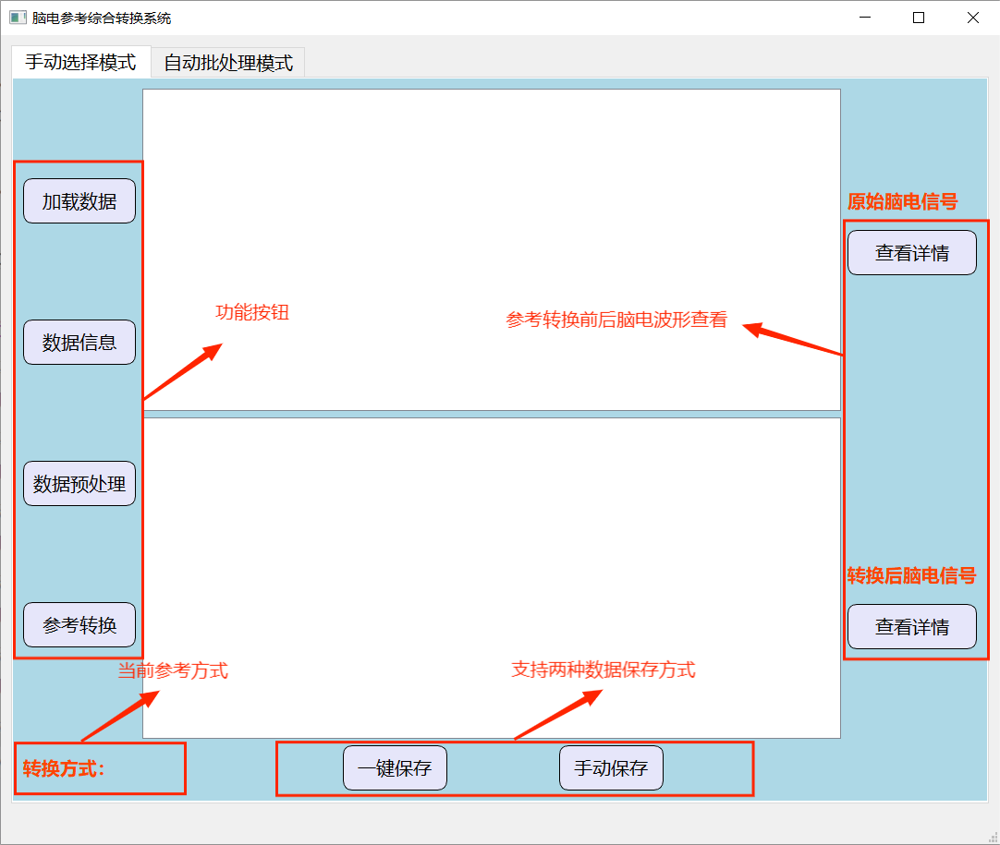

# PyEEGref: EEG reference conversion system
# We have developed a comprehensive EEG reference conversion system based on Python.
# The system is mainly divided into two parts, manual selection module and automatic batch processing module.
# The following are two parts of user interface design.
# Manual selection of modules:
 
